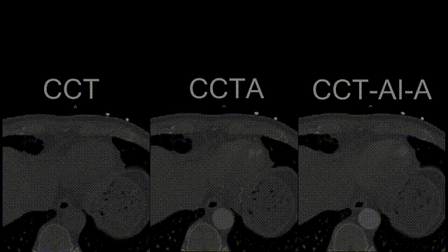
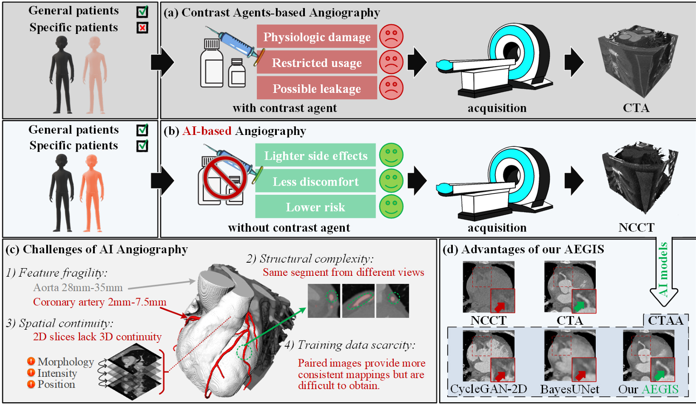
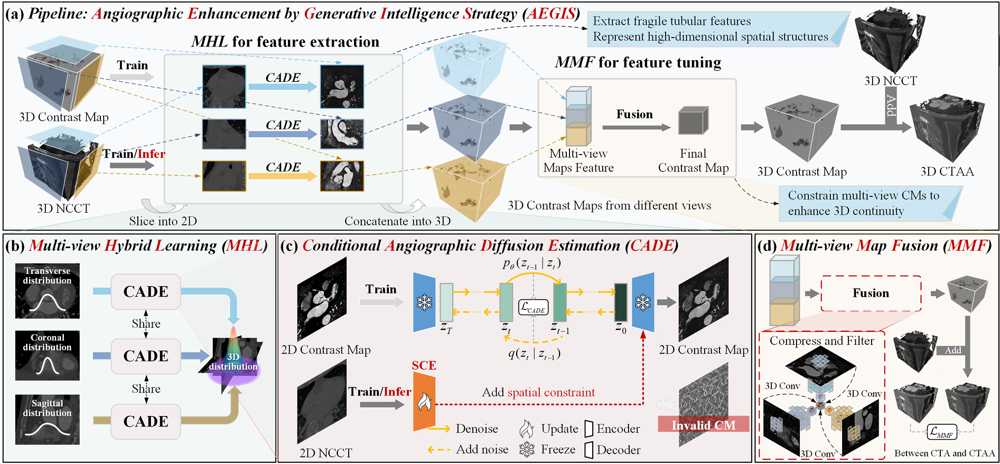
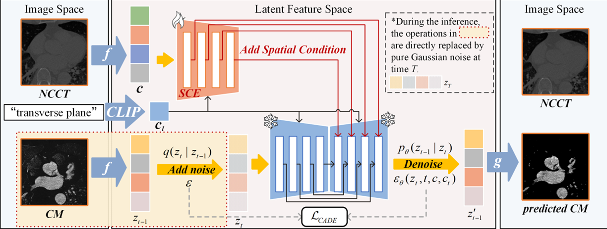
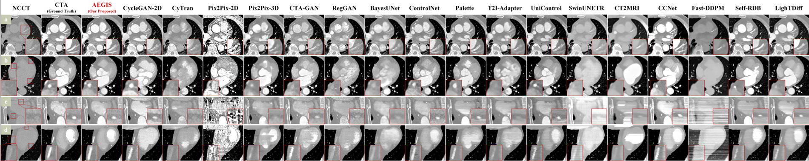
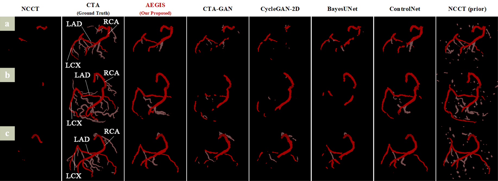
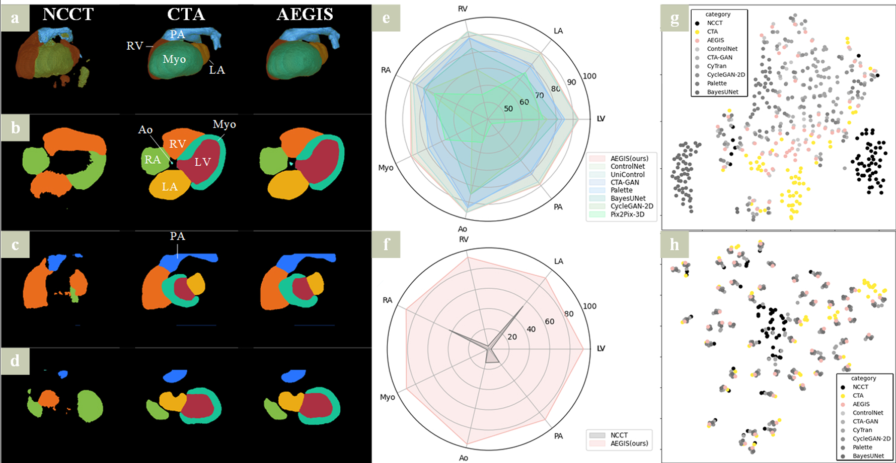

# AEGIS: Using Conditional Multi-View Diffusion Model to Achieve Angiographic Enhancement in Non-contrast CT

[](https://github.com/jiahaoxia-list/AEGIS)  [](https://ieeexplore.ieee.org/document/11296873/)

📌 **Repository**: https://github.com/jiahaoxia-list/AEGIS  
📄 **Paper**: https://ieeexplore.ieee.org/document/11296873/



***Note: CCT means Coronary CT, which is a kind of non-contrast CT without using angiography technology.*** 


***Note: The process can be found in `doc/process.mp4`.*** 

  
This repository is the **official implementation** of the paper *AEGIS: Using Conditional Multi-View Diffusion Model to Achieve Angiographic Enhancement in Non-contrast CT*.  
The project is implemented in **PyTorch**, and we release the **training code**, **inference code**, **pretrained checkpoints**, and **several sample cases**.  
The full dataset is **not yet publicly available**, but we are actively working on releasing it in the future.

## ✨ Paper Summary

Angiographic enhancement of non-contrast CT (NCCT) using AI techniques is essential for diagnosing patients unable to use contrast agents. However, AI angiography remains a challenging task because of the feature fragility, structural complexity, and spatial continuity. In this paper, we propose an angiographic framework based on a conditional multi-view diffusion model called AEGIS with three innovations: multi-view hybrid learning (MHL), conditional angiographic diffusion estimation (CADE), and multi-view map fusion (MMF). 1) MHL targets Contrast Map (CM), the difference between NCCT and CT angiography, from multiple views to perceive 3D features in 2D space, enhancing the stability of feature representation. 2) CADE is a conditional diffusion model using NCCT as spatial guidance, providing crucial information for CM generation. 3) MMF adopts a lightweight AutoEncoder for filtering and fusing multi-view CMs, maintaining coherence between adjacent slices while modifying slight bias in low-dimensional representations, thus optimizing data quality and accuracy. Experiments demonstrate our superior performance, which achieve state-of-the-art image quality (PSNR+6.69, SSIM+3.17, MSE-46.38), segmentation evaluation (CADIR×10.49, HSDIR×5.57) and feature distance (FID-64.27). Visualizations and positive evaluation scores from clinicians further reveals that AEGIS has significant potential in clinical applications.





## 🔧 1. Setup

### 1.1 Clone the repository
```bash
git clone https://github.com/jiahaoxia-list/AEGIS.git
cd AEGIS
```

### 1.2 Create environment

* Python version: **>= 3.9.18**
* Create a conda environment named `AEGIS` according to `requirements.txt`

```bash
conda create -n AEGIS python=3.8.5
conda activate AEGIS
pip install -r requirements.txt
```

### 1.3 Manually install dependencies

Please manually install the following packages from the provided `.whl` files in `whl` folder:

* `torchslime-0.1.0`
* `prefetch_generator`

### 1.4 Hardware requirement

We trained our model on NVIDIA GeForce RTX 4090 (24GB).
At least 16GB.

---

## 🚀 2. Inference

### 2.1 Download pretrained checkpoint

The pretrained checkpoint can be downloaded from **[Huggingface](https://huggingface.co/SharkAsuka/AEGIS)**

Place the checkpoint in the appropriate directory as specified in the code.

You can also find sample data here **[Google Drive](https://drive.google.com/file/d/11Rw9HEPPhstl_AKyFIyn3R9NA0ZHzGqS/view?usp=drive_link)**

### 2.2 CLIP model note (for users in mainland China)

If you encounter download issues for
`openai/clip-vit-large-patch14`, please follow the steps below:

```bash
export HF_ENDPOINT=https://hf-mirror.com
huggingface-cli download openai/clip-vit-large-patch14
```

Then:
1. Download the model to a local directory
2. Modify `FrozenCLIPEmbedder.__init__()` in `ldm/modules/encoders/modules.py`
3. Set `version = <your_local_clip_folder>`

### 2.3 Run inference

1. Modify `file_root` in `z6_inference.py`

   * Point it to the folder containing **non-contrast CT data**
   * Input files must be in **NIFTI format**
2. Run:

```bash
python z6_inference.py
```

🎯 The script will directly generate the **angiographic enhancement results**.

---

## 📊 3. Results Visualization

### 3.1 Qualitative results

**Experimental results:**





### 3.2 Quantitative comparison

**Table: Quantitative comparison with 18 baseline methods**
(7 metrics, 19 methods in total)

| Model                                  | PSNR ↑   |SSIM (%) ↑|  MSE ↓   | CADIR ↑  | HSDIR ↑  |  FID ↓   |Time (s) ↓|
| -------------------------------------- | -------- | -------- | -------- | -------- | -------- | -------- | -------- |
| NCCT |  30.39±0.97 | 94.05±0.78| 60.91±14.04|   -   |   -   | 80.95±30.14|   -   |
| CycleGAN-2D [[Code]](https://github.com/junyanz/pytorch-CycleGAN-and-pix2pix)|35.42±1.64| 96.00±0.84 |  20.11±8.15|  6.38±5.78 | 4.20±1.34|18.11±10.47| 23|
| CyTran [[Code]](https://github.com/ristea/cycle-transformer) |34.65±1.66|  95.81±0.83| 24.00±9.51| 0.36±0.37| 1.81±0.92  | 55.70±23.94|28 |
| Pix2Pix-2D [[Code]](https://github.com/junyanz/pytorch-CycleGAN-and-pix2pix) | / |/ |  / |   / | / |  55.87±23.80| 19|
| Pix2Pix-3D [[Code]](https://github.com/neoamos/3d-pix2pix-CycleGAN) |34.93±1.50|95.81±0.75|22.23±8.37|3.30±3.59 | 3.73±1.19|31.88±17.49|5|
| CTA-GAN [[Code]](https://github.com/ristea/cycle-transformer) | 35.68±1.74|  96.17±0.79| 19.18±8.65| 7.06±6.42| 5.09±1.63| 17.82±10.72| 21|
| RegGAN [[Code]](https://github.com/deepdaiv-medical/RegGAN-EfficientUnet)  |35.23±1.69|  95.07±1.22| 21.15±9.05 |  3.32±3.77| 4.13±1.48|  30.79±18.08|35 |
| BayesUNet [[Code]](https://github.com/sandeshkatakam/3D-BayesU-Net-Model) | 35.65±2.01 | 96.73±0.73| 15.81±8.27|  5.13±4.94| 4.64±1.51 |  25.84±17.86| **2** |
| Swin UNETR [[Code]](https://github.com/Project-MONAI/research-contributions/tree/main/SwinUNETR/Pretrain)   | 33.86±2.12| 94.97±0.89| 29.41±10.13 | 2.45±2.06| 1.44±0.32 |42.79±19.28 | 6|
| ControlNet [[Code]](https://github.com/lllyasviel/ControlNet)   | 36.27±1.62|96.79±0.89| 19.40±8.09| 7.70±4.38 | 5.51±1.82 | 17.49±12.08 |  1014|
| Palette [[Code]](https://github.com/Janspiry/Palette-Image-to-Image-Diffusion-Models) | 35.93±1.91 | 96.30±1.03 |  18.36±8.72| 5.41±5.67|  5.07±1.69| 23.95±13.54 | 1289|
| T2I-Adapter [[Code]](https://github.com/TencentARC/T2I-Adapter)  |36.07±1.99 | 96.52±0.80 | 17.90±8.86| 2.18±2.06|  3.79±1.45| 33.11±22.13| 1161|
| UniControl [[Code]](https://github.com/salesforce/UniControl) |35.61±1.36 |  96.33±1.30|20.70±7.98|3.56±3.89 |5.48±1.83 | 33.61±21.77 | 1382|
| CT2MRI [[Code]](https://github.com/MICV-yonsei/CT2MRI) | 35.47±1.76 |  95.25±1.45| 22.70±9.56 | 2.87±2.41| 1.03±0.41 |  38.76±17.92 |  872|
| CC Net [[Code]](https://github.com/RichardObi/ccnet)   | 36.33±1.92 | 96.61±0.84 |  16.43±8.49| 7.92±6.48 | 4.92±1.43 |23.47±15.99 |  1854|
| Fast-DDPM [[Code]](https://github.com/mirthAI/Fast-DDPM)  |27.02±4.93| 94.13±2.32 | 48.62±13.58 |  0.87±0.53| 0.62±0.26|  65.15±26.35 |  660 |
| SelfRDB [[Code]](https://github.com/icon-lab/SelfRDB)  | 36.18±2.08 |  96.77±0.73| 14.88±8.96 | 8.61±6.44 |  5.43±1.73 |20.79±14.22|  1127 |
| LighTDiff [[Code]](https://github.com/DavisMeee/LighTDiff) |36.40±1.24| 96.81±0.80 |15.89±7.82| 8.76±7.92| 5.53±1.82|19.48±12.70 | 254 |
| **AEGIS (Ours)**                       | **37.08±2.20** | **97.22±0.86** |**14.53±8.00**|**10.49±9.85** |**5.57±1.88** | **16.68±11.46**|  345|

---

## 🏋️ 4. Training on Your Own Dataset

### Step 1: Data preparation

* Training requires **paired CT and CTA** from approximately the same acquisition time
* Perform registration using **[Elastix](https://elastix.dev)**
  * Parameter file: [par0044.txt](https://lkeb.ml/modelzoo/par0044/)

After registration:

1. Organize 3D data according to the directory format in `z0_my_preprocess.py`
2. Modify `root_path`
3. Run:

```bash
python z0_my_preprocess.py
```

This step computes dataset statistics (mean, variance, etc.)

---

### Step 2: Initialize CADE with Stable Diffusion

CADE is initialized from a pretrained **Stable Diffusion v1.5** model.

1. Download [v1-5-pruned.ckpt](https://huggingface.co/runwayml/stable-diffusion-v1-5/blob/main/v1-5-pruned.ckpt)
2. Run:

```bash
python z0_my_tool_add_control.py {YOUR_PATH}/v1-5-pruned.ckpt CADE_utils/CADE_ini.ckpt
```

---

### Step 3: Dataset configuration

In `z1_my_dataset.py`:

* Default dataset loaders are provided
* Default normalization: **unified value range normalization**
* You may change to:
  * constant value normalization
  * min–max normalization
  * mean–std normalization

⚠️ Training and inference **must use the same normalization scheme**

* Training:

  * Source: CT
  * Target: CTA − CT (contrast map)
  * Prompt: slice view information
* Note:

  * Training uses **2D slices**
  * Inference uses **3D volumes**

---

### Step 4: Train CADE

In `z2_my_train.py`:

* Set `resume_path` as `CADE_ini.ckpt` (from Step 2) or our provided [pretrained weights](https://huggingface.co/SharkAsuka/AEGIS/tree/main)
* Run:

```bash
python z2_my_train.py
```

---

### Step 5: CADE prediction

Generate initial contrast maps:

1. Modify `resume_path`
2. Modify dataset paths
3. Run:

```bash
python z3_prediction.py
```

---

### Step 6: MMF configuration

Edit `MMF_utils/z0_my_config.py`:

* Training epochs
* Hyperparameters
* Evaluation metrics
* Dataset root path (3D volumes)

Optional customization:

* Data preprocessing: `MMF_utils/dataset.py`
* Metrics: `MMF_utils/metric.py`
* Loss functions: `MMF_UNet/losses.py`

---

### Step 7: Train MMF

In `z4_my_train.py`:

* Set `dist_need` to enable/disable distributed training
* Run:

```bash
python z4_my_train.py
```

---

### Step 8: MMF inference

1. Set MMF checkpoint in `z5_prediction.py`
2. Run:

```bash
python z5_prediction.py
```

---

## 🙏 5. Acknowledgements

This work is built upon the following excellent open-source projects:

* Stable Diffusion
  [https://github.com/CompVis/stable-diffusion](https://github.com/CompVis/stable-diffusion)
* ControlNet
  [https://github.com/lllyasviel/ControlNet](https://github.com/lllyasviel/ControlNet)
* torchslime
  [https://github.com/Slymer-Tech/torchslime](https://github.com/Slymer-Tech/torchslime)
* PyTorch Lightning
  [https://github.com/Lightning-AI/pytorch-lightning](https://github.com/Lightning-AI/pytorch-lightning)

We sincerely thank the authors for their valuable contributions.

*This document was generated with the assistance of ChatGPT.*

---

## 📚 Citation

If you find this work useful, please cite:

```bibtex
@ARTICLE{11296873,
  author={Xia, Jiahao and Zhang, Xiaolei and He, Yuting and Qi, Yaolei and Hu, Yutao and Haigron, Pascal and Tang, Chunxiang and Zhang, Longjiang and Yang, Guanyu},
  journal={IEEE Transactions on Circuits and Systems for Video Technology}, 
  title={AEGIS: Using Conditional Multi-View Diffusion Model to Achieve Angiographic Enhancement in Non-Contrast CT}, 
  year={2026},
  volume={36},
  number={5},
  pages={6586-6600},
  keywords={Artificial intelligence;Angiography;Diffusion models;Contrast agents;Computed tomography;Three-dimensional displays;Biomedical imaging;Feature extraction;Image segmentation;Chemicals;Conditional diffusion model;AI-generated content;contrast agent free;3D angiographic enhancement},
  doi={10.1109/TCSVT.2025.3642730}}
```

