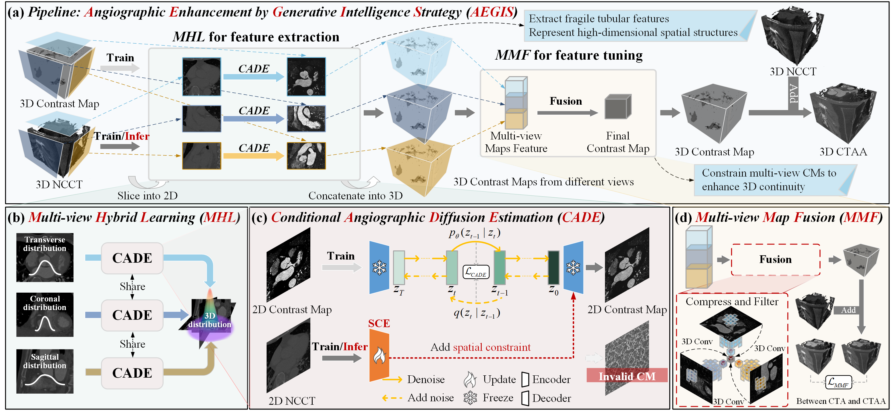
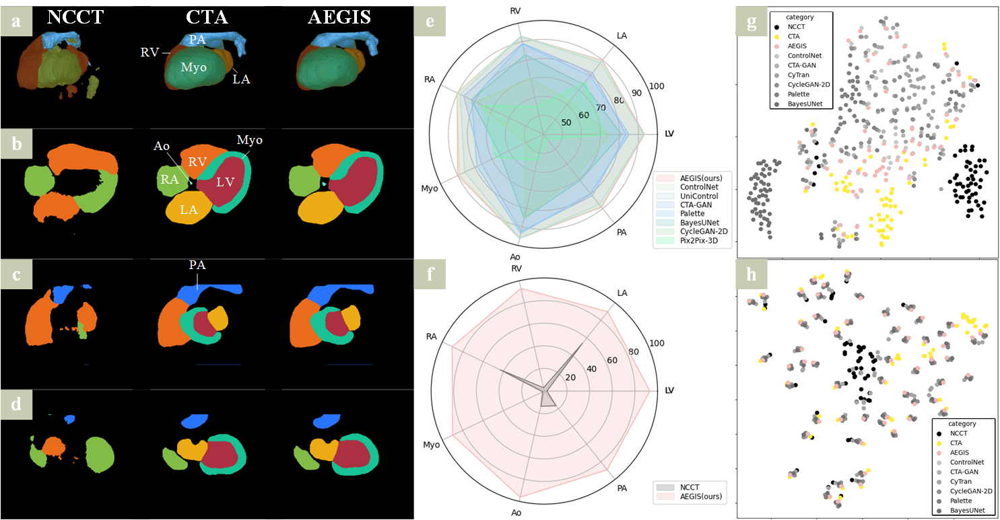

# AEGIS: Using Conditional Multi-View Diffusion Model to Achieve Angiographic Enhancement in Non-contrast CT
 

[//]: # ([![arXiv]&#40;https://img.shields.io/badge/arXiv-b31b1b.svg&#41;]&#40;https://arxiv.org/abs/xx&#41;)

## Paper
paper will be available soon...
## Code
code will be available soon...
## Background

Fig. 1. Contrast agents-based versus AI-based angiography (e.g., coronary CT). 

## Architecture

Fig. 2.  The overall framework of AEGIS. 

Fig. 3. Detailed Architecture of CADE.

## The process of training and inference

## Result

Fig. 4. Comparison of CTAA enhancement effects across different methods.

| Method           |PSNR↑          | SSIM↑          | MSE↓           | CADIR↑         | HSDIR↑        | FID↓            |
|------------------|---------------|----------------|----------------|----------------|---------------|-----------------|
| NCCT             | - | 30.39±0.97     | 94.05±0.78     | 60.91±14.04    | -              | -             | 80.95±30.14     |
| CycleGAN-2D      | 35.42±1.64     | 96.00±0.84     | 20.11±8.15     | 6.38±5.78      | 4.20±1.34     | 18.11±10.47     |
| CyTran           | 34.65±1.66     | 95.81±0.83     | 24.00±9.51     | 0.36±0.37      | 1.81±0.92     | 55.70±23.94     |
| Pix2Pix-2D       | /              | /              | /              | /              | /             | 55.87±23.80     |
| Pix2Pix-3D        | 34.93±1.50     | 95.81±0.75     | 22.23±8.37     | 3.30±3.59      | 3.73±1.19     | 31.88±17.49     |
| CTA-GAN           | 96.17±0.79     | 19.18±8.65     | 7.06±6.42      | 5.09±1.63     | 17.82±10.72     |
| RegGAN         [code]</a>| 35.23±1.69     | 95.07±1.22     | 21.15±9.05     | 3.32±3.77      | 4.13±1.48     | 30.79±18.08     |
| BayesUNet        | 35.65±2.01     | 96.73±0.73     | 15.81±8.27     | 5.13±4.94      | 4.64±1.51     | 25.84±17.86     |
| ControlNet       | 96.79±0.89     | 19.40±8.09     | 7.70±4.38      | 5.51±1.82     | 17.49±13.08     |
| Palette         | 35.93±1.91     | 96.30±1.03     | 18.36±8.72     | 5.41±5.67      | 5.07±1.69     | 23.95±13.54     |
| T2I-Adapter     | 36.07±1.99     | 96.52±0.80     | 17.90±8.86     | 2.18±2.06      | 3.79±1.45     | 33.11±22.13     |
| UniControl      | 35.61±1.36     | 96.33±1.30     | 20.70±7.98     | 3.56±3.89      | 5.48±1.83     | 33.61±21.77     |
| **AEGIS (ours)**| **37.08±2.20** | **97.22±0.86** | **14.53±8.00** | **10.49±9.85** | **5.57±1.88** | **16.68±11.46** |

Fig. 5. Visualization of coronary segmentation.

Fig. 6. Visualization of whole heart substructure segmentation results and scatter plots of feature spatial distribution. 

Fig. 7. Angiography in regions with calcified and non-calcified plaques.

## 2 examples shown in video

## more results

